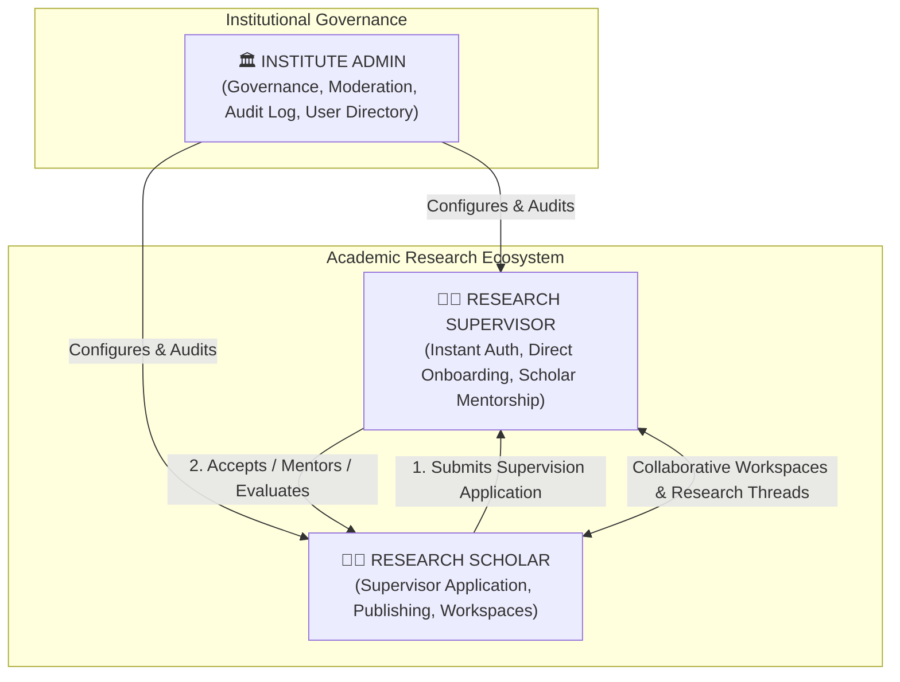
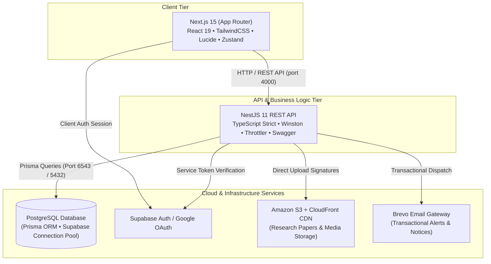

# CuriousBees — Institutional Academic Collaboration & Governance Platform

<div align="center">

  
  
  
  
  
  
  
  

  <p align="center">
    <strong>A next-generation digital research ecosystem connecting scholars, faculty supervisors, and university leadership into a structured, audited academic workspace.</strong>
  </p>

  <p align="center">
    <a href="#-executive-overview">Executive Overview</a> •
    <a href="#-role-architecture--governance">Role Architecture</a> •
    <a href="#-monorepo-structure">Monorepo Structure</a> •
    <a href="#-quick-start">Quick Start</a> •
    <a href="#-scripts-reference">Scripts Reference</a> •
    <a href="#-system-architecture">Architecture</a> •
    <a href="./docs/README.md">Documentation Portal</a>
  </p>

</div>

---

## 🧭 Executive Overview

**CuriousBees** is an enterprise-grade digital research collaboration and academic governance platform designed specifically for higher education institutions (SRMIST). It unifies Ph.D. lifecycle supervision, research discovery, collaborative sandboxes, publication tracking, and institutional administration into a single high-performance monorepo.

### 🌟 Core Value Pillars

* **🎓 Ph.D. Supervision & Mentorship Lifecycle**: Scholars discover prospective supervisors, apply directly through the portal, and track doctoral milestones in shared collaborative sandboxes.
* **⚡ CuriousNexus Research Hub**: Interactive discovery feed with trending research clusters, real-time discussions, and campus event schedules.
* **📑 Publication & Evidence Registry**: Centralized repository for research papers, thesis drafts, DOIs, and scholarly achievements backed by AWS S3 and CloudFront CDN.
* **🏛️ Institutional Governance & Compliance**: Role-based access control, departmental hierarchies, content moderation queues, and an **immutable, append-only `AuditLog`** recording every administrative action.
* **📬 Transactional Notification Gateway**: Integrated Brevo transactional email engine and in-app notification center keeping all participants synchronized.

---

## 🏛️ Role Architecture & Governance

CuriousBees enforces strict separation of concerns across three primary institutional roles:



### 1. 🧑‍🎓 Research Scholar
- Direct authentication via institutional Google account (`@srmist.edu.in`).
- Discovers faculty supervisors across campus faculties and departments; submits supervision applications.
- Authors research publications, logs thesis progress reports, and manages shared research workspaces.
- Participates in academic discussion threads and event calendars.

### 2. 👨‍🏫 Research Supervisor
- **Instant Authentication & Onboarding**: Fully active immediately upon sign-in with **no administrative bottleneck or approval wait**.
- Reviews, approves, or rejects scholar supervision applications directly.
- Evaluates doctoral progress reports, co-authors publications, and mentors candidates inside dedicated workspaces.
- Publishes research opportunity listings and vacancies for prospective scholars.

### 3. 🏛️ Institute Admin
- Operates the institutional governance command center at `/admin/*`.
- Manages university organizational structures (Faculties, Departments, Campus Nodes).
- Moderates platform content, resolves reported threads/comments, and handles user account suspensions.
- **Immutable Audit Trail**: Every administrative action requires a recorded justification and permanently commits to the append-only `AuditLog` table.
- **Zero Research Authoring Clutter**: Pure governance, compliance, and institutional administration.

---

## 🏗️ System Architecture

The platform is designed around a modern decoupled monorepo topology:



---

## 📂 Monorepo Structure

```text
CuriousBees_V2/
├── apps/
│   ├── web/                        # Next.js 15 App Router frontend application
│   │   ├── src/
│   │   │   ├── app/                # App Router pages (Auth, Portal, Admin, Nexus)
│   │   │   ├── components/         # Atomic UI, layouts, widgets, modals, charts
│   │   │   ├── hooks/              # Custom React hooks (auth, feed, notifications)
│   │   │   ├── lib/                # API client, Supabase client/server, utilities
│   │   │   └── store/              # Zustand global state stores
│   │   └── public/                 # Brand assets, logos, and static media
│   └── api/                        # NestJS 11 modular enterprise backend API
│       ├── prisma/
│       │   ├── schema.prisma       # Master PostgreSQL database schema & indexes
│       │   └── seed.ts             # Seed script (faculties, departments, admin)
│       └── src/
│           ├── auth/               # Supabase JWT guards & role authorization
│           ├── admin/              # Governance command center & user moderation
│           ├── feed/               # Research feed, interactions & discovery
│           ├── supervisors/        # Faculty supervisor profiles & matching
│           ├── supervisor-requests/# Scholar-Supervisor application workflows
│           ├── workspaces/         # Collaborative sandboxes & milestones
│           ├── publications/       # Scholarly publications registry
│           ├── opportunities/      # Research opportunity vacancies board
│           ├── notifications/      # In-app and Brevo email notifications
│           └── common/             # Interceptors, filters, and audit logger
├── packages/
│   ├── types/                      # Shared TypeScript models, interfaces, and enums
│   ├── constants/                  # Shared tokens, roles, cookie keys, and configs
│   ├── shared-utils/               # Common HTTP fetchers, validators, formatters
│   └── ui/                         # Design system primitives and UI tokens
├── docs/                           # Centralized documentation directory
│   ├── architecture/               # Blueprints, tech stack, capacity & cost models
│   ├── database/                   # Relational schemas, ER diagrams & indexing
│   ├── deployment/                 # Railway, Vercel, Docker & CI/CD runbooks
│   ├── audits/                     # Security audits & deployment validation
│   ├── auth/                       # Admin-managed authentication specifications
│   ├── development/                # Health checks & developer bypass specs
│   └── guides/                     # Developer onboarding & OS installation guides
├── scripts/                        # Monorepo maintenance and diagnostics scripts
│   ├── setup.js                    # Automated package build and Prisma generator
│   ├── doctor.js                   # Preflight diagnostic health checker
│   ├── health-check.js             # Live API & database connectivity probe
│   └── db-setup.js                 # Complete database reset and seed runner
├── .github/                        # GitHub Actions CI/CD workflows and PR templates
├── Dockerfile.api                  # Production multi-stage Docker build for NestJS API
├── Dockerfile.web                  # Production multi-stage Docker build for Next.js
├── docker-compose.yml              # Local PostgreSQL container definition
└── package.json                    # Root npm workspace orchestrator
```

---

## ⚡ Quick Start (Local Development)

### 1. Prerequisites
* **Node.js**: `>= 22.0.0` (LTS recommended)
* **npm**: `>= 10.0.0`
* **PostgreSQL**: Local instance or Supabase cloud project

### 2. Install Dependencies
```bash
npm install --legacy-peer-deps
```

### 3. Configure Environment Variables
```bash
cp .env.example .env
```
_Edit `.env` and configure your `DATABASE_URL`, `DIRECT_URL`, `NEXT_PUBLIC_SUPABASE_URL`, `NEXT_PUBLIC_SUPABASE_ANON_KEY`, `SUPABASE_SERVICE_ROLE_KEY`, and `BREVO_API_KEY`._

### 4. Initialize Packages & Prisma Client
```bash
npm run setup
```

### 5. Run Preflight Diagnostics Check
```bash
npm run doctor
```

### 6. Start Development Servers
```bash
npm run dev
```

* 🌐 **Web Application**: [http://localhost:3000](http://localhost:3000)
* 📡 **REST API Gateway**: [http://localhost:4000](http://localhost:4000)
* 📖 **API Documentation (Swagger)**: [http://localhost:4000/api/docs](http://localhost:4000/api/docs)
* 🩺 **API Health Telemetry**: [http://localhost:4000/api/health](http://localhost:4000/api/health)

---

## 🛠️ Monorepo Scripts Reference

| Command | Workspace Scope | Description |
| :--- | :--- | :--- |
| `npm run dev` | Root | Concurrently boots Next.js frontend (`:3000`) and NestJS API (`:4000`). |
| `npm run dev:web` | `apps/web` | Starts Next.js development server with hot module reloading. |
| `npm run dev:api` | `apps/api` | Starts NestJS development server with file watchers. |
| `npm run build` | Root | Builds shared packages (`types`, `constants`, `shared-utils`), Web, and API. |
| `npm run build:packages` | `packages/*` | Compiles TypeScript shared packages into `dist/` bundles. |
| `npm run typecheck` | Root | Strictly verifies TypeScript across all workspaces with zero emissions. |
| `npm run lint` | Root | Runs ESLint across all workspaces. |
| `npm run setup` | Root | Automated initialization: validates `.env`, builds packages, generates Prisma client, runs doctor. |
| `npm run doctor` | Root | Comprehensive preflight check: Node runtime, env variables, Supabase keys, DB connectivity. |
| `npm run health` | Root | Probes live running API service and reports DB status & uptime metrics. |
| `npm run db:generate` | `apps/api` | Generates typed Prisma Client from `schema.prisma`. |
| `npm run db:migrate` | `apps/api` | Executes pending database migrations. |
| `npm run db:seed` | `apps/api` | Seeds initial faculties, departments, and administrator accounts. |
| `npm run db:setup` | Root | Resets the database and seeds fresh data. |
| `npm run clean` | Root | Cleans all `node_modules`, `.next`, and `dist` build outputs. |
| `npm run reset` | Root | Full factory reset: cleans caches, reinstalls dependencies, and runs setup. |

---

## 🔐 Security & Governance Model

1. **Immutable Audit Trail**: All administrative changes (account suspensions, role promotions, supervisor reassignments, moderation actions) require a mandatory justification and write to the immutable `AuditLog` table.
2. **Dual-Layer Route Protection**:
   * **Edge Middleware (Next.js)**: Validates session tokens and enforces role-based URL access.
   * **Backend JWT Guards (NestJS)**: Verifies Supabase Bearer tokens, checking `ApprovedGuard` and `RolesGuard`.
3. **Strict Parameter Validation**: All inbound HTTP payloads are validated using `class-validator` and `zod` schemas.
4. **Security Headers**: Standardized `Helmet` integration enforcing CSP, HSTS, X-Frame-Options, and CORS protections.

---

## 🐳 Containerization & Deployment

CuriousBees includes production multi-stage Docker builds:

### Deploy API Container
```bash
docker build -t curiousbees-api -f Dockerfile.api .
docker run -d -p 4000:4000 --env-file .env --name cb-api curiousbees-api
```

### Deploy Web Container
```bash
docker build -t curiousbees-web -f Dockerfile.web .
docker run -d -p 3000:3000 --env-file .env --name cb-web curiousbees-web
```

For complete cloud hosting instructions (Vercel frontend, Railway / Docker backend, Supabase database), see the [Cloud Production Deployment Guide](./docs/deployment/DEPLOYMENT_GUIDE.md).

---

## 📚 Documentation Index

For in-depth guides and specifications, visit our documentation portal:

* 🏛️ **[System Architecture Guide](./docs/architecture/ARCHITECTURE.md)** — Architectural design and module relationships.
* 🗄️ **[Database Architecture & ERD](./docs/database/DATABASE_ARCHITECTURE.md)** — Relational tables, indexes, and pooling rules.
* 🚀 **[Cloud Production Hosting Runbook](./docs/deployment/DEPLOYMENT_GUIDE.md)** — Production deployment across Vercel, Railway, and S3.
* 📈 **[Capacity & Cloud Cost Analysis](./docs/architecture/PRODUCTION_CAPACITY_COST_ANALYSIS.md)** — Concurrency models and cloud cost projections.
* 🔒 **[Security & Governance Specification](./docs/audits/SECURITY_AUDIT.md)** — Security policies, headers, and rate limits.
* 🚀 **[Developer Quick Start Guide](./docs/guides/QUICK_START.md)** — 5-minute setup and onboarding guide.

---

## 👥 Contributing & Standards

1. Create a feature branch (`git checkout -b feature/your-feature-name`).
2. Follow Conventional Commits format (`feat:`, `fix:`, `chore:`, `docs:`).
3. Ensure all tests and type checks pass (`npm run typecheck && npm run lint`).
4. Submit a Pull Request targeting `main` using our [PR Template](.github/PULL_REQUEST_TEMPLATE.md).

---

## 📄 License & Attribution

CuriousBees is developed for **SRM Institute of Science & Technology**. All rights reserved.
