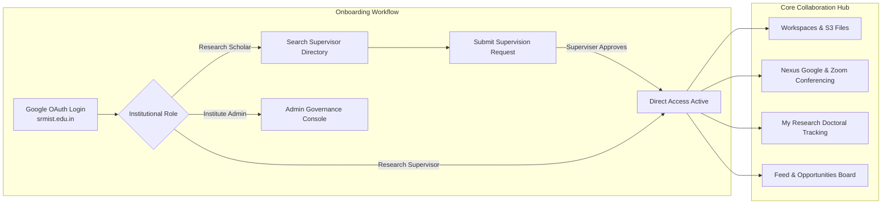

# CuriousBees V2 — Project Overview & Domain Model

**CuriousBees** is an enterprise-grade, institutional Academic Collaboration & Research Governance Platform designed specifically for university research ecosystems (e.g., SRMIST). It centralizes researcher onboarding, faculty supervision management, cross-departmental project recruitment, research output authoring, and institutional administrative compliance into a unified, secure digital platform.

---

## 👥 User Personas & Workflows

### 1. Research Scholars (PhD / Postdoc Researchers)
* **Direct Onboarding & Supervision Request:** Authenticates via university Google SSO. Selects an active faculty supervisor and submits a supervision proposal.
* **My Research Lifecycle:** Tracks research progress through 6 formal stages (Proposal $\rightarrow$ Literature Review $\rightarrow$ Methodology $\rightarrow$ Implementation $\rightarrow$ Evaluation $\rightarrow$ Thesis Publication) with milestone deadlines and activity logs.
* **CuriousNexus Collaboration Hub:** Connects with peer researchers across departments, initiates collaborative projects, shares workspace documents, launches Google Meet / Zoom conferences, and posts messages via REST API.
* **Output Authoring & Storage:** Publishes research posts, registers papers with DOI metadata, and uploads paper drafts and milestone evidence directly to **Amazon S3**.

### 2. Research Supervisors (Faculty Members)
* **Immediate Autonomous Access:** Registered and verified immediately via institutional SSO with **no admin bottleneck**.
* **Supervision Command Center:** Reviews inbound scholar supervision requests, inspecting candidate credentials, statement of purpose, and research areas before approving or rejecting (triggers automated Brevo email alerts).
* **Workspace Governance:** Creates research grant workspaces, assigns milestones, sets submission deadlines, shares research materials, and reviews scholar monthly progress reports.
* **Opportunities Board:** Posts funded PhD positions, research assistant openings, and cross-departmental project recruitments.

### 3. Institutional Administrators (University Officials)
* **Governance & Moderation Command Center (`/admin/*`):** Real-time monitoring of campus-wide research metrics, department activity timelines, and user distribution.
* **Bulk User Management:** Imports university rosters via Excel (`.xlsx`) with automated email uniqueness checks, role assignments, and department mappings.
* **Content & Compliance Moderation:** Reviews flagged posts, hides non-compliant content, reassigns supervisors, and enforces account suspensions with mandatory justifications.
* **Immutable Audit Trail:** All administrative actions are permanently recorded in the append-only `AuditLog` database entity.

---

## 🛠️ Core Modules & Capabilities

### 1. Research Workspaces (`/workspace/:id`)
Private collaborative workspaces containing:
* **Amazon S3 File Store:** Secure repository with file size, metadata, and uploaded-by telemetry.
* **Project Milestones:** Progress tracking with due dates, priority levels, and completion toggles.
* **Workspace Announcements:** Direct advisor-to-scholar communications and guidelines.
* **Conferencing Integrations:** One-click Google Meet and Zoom meeting link creation.

### 2. CuriousNexus Collaboration Hub (`/nexus`)
Cross-disciplinary collaboration suite providing:
* **Controlled Request Pipeline:** Send, accept, decline, and track collaboration requests.
* **Google Workspace & Zoom Integrations:** Integrated Google Meet, Google Chat Spaces, and Zoom Workplace meeting rooms.
* **Shared Advisory Timeline:** Unified file and milestone repository between collaborating researchers.

### 3. My Research Portal (`/scholar/my-research`)
Doctoral milestone manager tailored for PhD progress reviews, enabling scholars to record achievements, link external profiles (ORCID, Google Scholar, ResearchGate), and submit periodic reports for supervisor sign-off.

### 4. Opportunities Board (`/opportunities`)
University-wide talent discovery board for funded projects, lab openings, and research grants with integrated candidate application workflows.

---

## 🏗️ Production Capacity Tiers

CuriousBees is engineered to support institutional scale across three validated budget tiers:
* **Base Tier (₹1,500 – ₹3,000 / mo):** 30–50 concurrent users, 2,500 registered scholars, 25 GB S3 storage.
* **Standard Tier (₹3,000 – ₹4,500 / mo):** 100–150 concurrent users, 10,000 registered scholars, 100 GB S3 storage.
* **Scale Tier (₹4,500 – ₹6,500 / mo):** 250–350 concurrent users, 25,000 registered scholars, 300 GB S3 storage.
